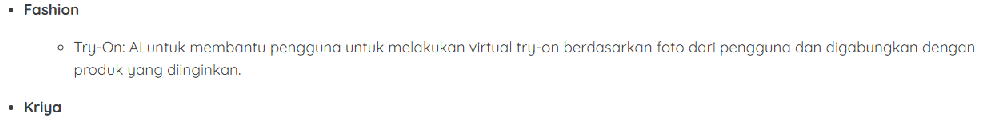

# Amazon-vto
Saya mulai belajar di sini karena saya berfikir untuk membuat Virtual Try-On. Awal project ini ingin aku buat karena saya sempat jadi shopee affiliator dengan membuat konten dari AI, dengan mengupload foto produk dan model di GenAI lalu membuatkan saya bentuknya di badan model yang aku berikan.
Kemudian saya berfikir instead of use that method, kenapa tidak biarkan pelanggan saja yang mencoba baju itu di foto mereka sendiri? Jadi lah aku berencana untuk membuatnya.
Beberapa setelah itu (aku belum mulai project sih, masih rencana wkwkw), ada AWS hackathon yang salah satu pilihan use casenya itu ada Fashion dan Kriya. Pada use case Fashion, kita diminta untuk membuat Try-On.

Okedeh itu dulu. Nanti kita lanjut

## Perkenalan Amazon

Hari ini saya coba pakai Amazon Q Dev untuk VSCode. Terus saya coba bagaimana menggunakannya untuk java script. Ternyata cukup bagus untuk saya yang tidak andal dalam hal ini. Selain Amazon Q ini, saya juga coba pakai Gemini Code Assist untuk menjawab beberapa pertanyaan seperti fungsi yang disarankan oleh Amazon Q.

Di Amazon Q —namanya terlalu panjang, kita singkat saja jadi Q— saya coba minta dibuatkan fungsi untuk menghitung luas persegi, persegi panjang, dan segitiga. Terus saya dibuatkan fungsi perhitungan luas bangun itu berikut dengan fungsi untuk print value dari hasil perhitungannya. Di Q juga saya dikasih saran untuk menggunakan 2 opsi penggunaan function, ada arrow function dan ada juga regular function untuk membuat fungsi yang lebih kompleks.

Saya coba pakai Gemini Code Assist untuk menjawab pertanyaan tentang bagaimana cara membuat fungsi di java script. Saya minta dibuatkan fungsi untuk menghitung luas persegi panjang. Jawaban yang diberikan cukup bagus, ada penjelasan tentang parameter yang digunakan, ada juga contoh pemanggilan fungsi tersebut.

Dari jawaban Genimi Code Assist —namanya juga panjang, saya malas nulisnya. Ganti aja jadi Gen—, saya tahu cara membuat kode kita modular dan dapat digunakan kembali di berbagai bagian aplikasi tanpa ditulis ulang dengan menggunakan module.exports. Contoh penggunaanya seperti di bawah ini:

module.exports = {
  calculateSquareArea,
  calculateRectangleArea,
  calculateTriangleArea,
};

dengan menggunakan module.exports itu, kita bisa menggunakan ke-3 fungsi yang sudah kita deklarasikan di file selain index.js. Kalo misalnya kita punya file app.js, di direktori yang sama. Kita bisa menggunakan fungsi dari index,js seperti ini:

// Mengimpor fungsi-fungsi yang diekspor dari index.js
const shapeCalculators = require('./index.js');

// Sekarang Anda bisa menggunakan fungsi-fungsi tersebut
const side = 10;
const squareArea = shapeCalculators.calculateSquareArea(side);

console.log(`Luas persegi dengan sisi ${side} adalah `); // Output: Luas persegi dengan sisi 10 adalah 100

const length = 8;
const width = 5;
const rectangleArea = shapeCalculators.calculateRectangleArea(length, width);

console.log(`Luas persegi panjang dengan panjang  dan lebar  adalah `); // Output: Luas persegi panjang dengan panjang 8 dan lebar 5 adalah 40.

Singkatnya, module.exports adalah cara untuk membuat kode Anda modular dan dapat digunakan kembali di berbagai bagian aplikasi kita.

## Belajar Javascript

Untuk menjalan source code atau program Javascript, kita butuh yang namanya runtime environment. Ada dua runtime envi yang bisa kita gunakan, yaitu node dan bun.
Kita bisa menjalankan aplikasi dengan mengetik node [file.js]. Kalo dengan bun, kita bisa menggunakan bun run [file.js] atau bisa hanya dengan menggunakan bun [file.js]. Command itu bisa digunakan di terminal untuk menjalankan program Javascript yang telah kita buat.
Untuk menjalankan runtime kita juga bisa menggunakan REPL atau Read-Eval-Print-Loop untuk langsung mengetik kode yang akan dijalankan di runtime tadi. Kita tidak perlu menaruhnya dalam sebuah script untuk menjalankan perintah itu.

